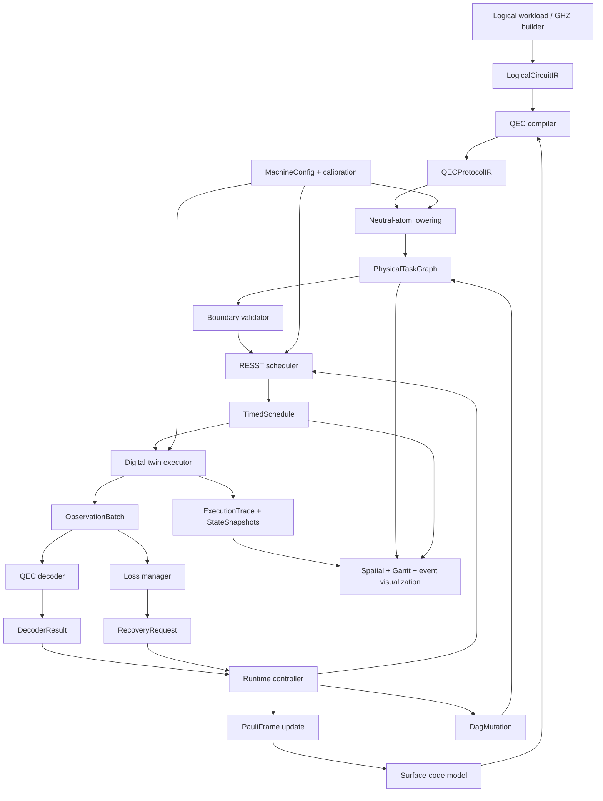

# Neutral-Atom FTQC Runtime：架构与实施计划

状态：首轮架构基线（2026-09-04）  
范围：架构审查与计划，不包含大规模实现  
目标仓库：`physics-Yu/neutral-atom-ftqc`

## 1. 决策摘要

本项目应被实现为一个事件驱动的实验执行栈，而不是一个接收逻辑门的量子态模拟器。唯一可被 RESST 与数字孪生执行的对象是已完全降低的物理实验指令。编译器、调度器、数字孪生、解码器、损失管理器和运行时控制器必须通过带版本的显式数据契约通信。

首个可交付纵向切片采用可配置距离的旋转表面码（演示配置为 `d=3`），用四个逻辑块准备 GHZ。第一阶段使用确定性、理想化的物理效果，但运动、区域占用、资源竞争和持续时间不能被省略。第二层两个逻辑 CNOT 保留逻辑并行性，由物理资源配置决定其并行或串行。

RESST 文档给出的 `任务（task）/任务实例（shot）/运行池（run pool）/锁（lock）/消息（message）/优先级（priority）` 是有价值的概念模型，但仓库中尚无 RESST 代码。建议保留这些概念作为调度策略与兼容视图，同时以“物理任务 DAG + 容量资源 + 条件令牌 + 确定性事件调度”作为软件原型的核心表示。二元锁是容量为 1 的资源特例，消息是事件存储中的可消费/不可消费条件令牌；这样既忠实于 RESST，又能表达区域容量、多个激光通道和部分重调度。

## 2. 审查范围与证据

已审查主分支完整递归文件树、全部源码与文档、示例、测试占位、项目配置和近期提交历史，并核对随任务提供的《RESST：实时多线程测控架构》v0.1.1（11 页）。主分支只有 `main`，当前提交为 `504a4b4c1f390afd2373cfaaa3d8fb639e08d5a9`。

### 2.1 仓库现状

| 区域 | 已有内容 | 成熟度 | 可复用性 |
| --- | --- | --- | --- |
| 项目配置 | Python 3.11、setuptools、pytest 可选依赖 | 可用骨架 | 可直接保留 |
| `src/compiler/` | logical IR、physical IR、compiler 模块说明 | 仅 docstring | 包边界可复用，类型与行为缺失 |
| `src/qec/` | surface code、logical qubit、Pauli frame 模块说明 | 仅 docstring | 职责划分可复用 |
| `src/scheduler/` | task、resource、scheduler、recovery 模块说明 | 仅 docstring | 名称可复用；`recovery.py` 后续应迁移职责 |
| `src/hardware/` | atom、geometry、zones、hardware state 模块说明 | 仅 docstring | 四区域边界可复用 |
| `src/simulator/` | executor、experiment、noise 模块说明 | 仅 docstring | 执行边界可复用；编排职责需移出 |
| `src/decoder/` | decoder、syndrome 模块说明 | 仅 docstring | 接口意图可复用 |
| `examples/` | GHZ 入口，当前只打印占位文本 | 占位 | 可作为最终 CLI 演示入口 |
| `docs/` | architecture、execution model、GHZ、ISA 草案 | 初步设计 | 原则可复用，本文件使其可实施化 |
| `tests/` | `.gitkeep` | 未实现 | 无现成测试 |

结论：仓库没有可调用的类、数据类型或算法；当前“RESST 实现”只存在于模块命名和文档意图中。不能声称已有调度算法可复用。真正可复用的是职责边界、命名、GHZ 工作负载定义和 RESST 概念模型。

### 2.2 RESST 可复用抽象

RESST 文档的核心软件抽象如下：

- `Task`：可重复执行、预编译的业务操作单元。
- `Shot`：一次具体任务实例，包含设备指令与元数据，是文档中的调度最小单元。
- `RunPool`：具有独立队列、优先级、所需锁和消息条件的派发单元。
- `Lock`：保护互斥硬件或实验条件；池-锁矩阵 `A` 推导池冲突矩阵 `C = A A^T`。
- `Message`：任务间数据/条件传递，可被消费或保留。
- `Priority`：有冲突且同时请求时的确定性仲裁依据。
- `PoolState`：Idle、Requesting、Running；启动条件是锁可用、无更高优先级竞争且消息已触发。
- 软件/硬件两级调度：PC 负责软实时编排；持久时钟和 FPGA/ASIC/RTOS 调度硬核负责纳秒级同步与相位连续性。

本项目的适配决策：一个 RESST `Shot` 对应一组已编译且可原子派发到设备的物理指令，而非逻辑门。单个物理 DAG 节点可以是一个 shot，也可以在后续设备后端中被打包为 shot；二者通过 `dispatch_group_id` 显式关联，不能隐式合并。

### 2.3 缺失能力

当前缺少：可构造的逻辑/QEC IR、表面码布局与稳定子、物理 ISA、带依赖的任务 DAG、资源与容量模型、RESST 仲裁算法、定时计划、机器状态转换、观察事件、确定性重放、运行时控制器、损失管理器、解码器实现、可视化数据模型、真实可视化、配置系统、验证器、测试与端到端演示。

## 3. 总体架构与信息流



### 3.1 模块边界

| 模块 | 负责 | 明确不负责 |
| --- | --- | --- |
| `logical` / `compiler.logical_ir` | 逻辑比特、逻辑操作、逻辑并行层、来源信息 | 物理时间和硬件资源 |
| `qec` | 码布局、数据/辅助比特角色、稳定子、逻辑算符、Pauli frame | 调度和设备执行 |
| `compiler` | 逻辑到 QEC 协议，再到物理任务 DAG 的降低与验证 | 最终开始时间、解码 |
| `hardware` | 不可变机器配置、几何、区域、资源、可变机器状态 | 逻辑 GHZ/QEC 意义 |
| `scheduler` | 依赖、容量、互斥、条件、优先级、时间与部分重调度 | 逻辑门、稳定子含义、解码策略 |
| `simulator` | 严格执行定时物理指令、修改机器状态、产生观察与轨迹 | 接受逻辑宏、替解码器作决定 |
| `decoder` | 从 syndrome/measurement/erasure 历史生成解码结果 | 分配原子和插入任务 |
| `runtime` | 协调观察、解码、损失管理、DAG 变更和重调度 | 吞并各领域算法 |
| `visualization` | 从只读轨迹与快照同步呈现空间、调度、事件 | 改写机器或调度状态 |

建议新增 `src/runtime/`、`src/loss/` 与 `src/visualization/`。现有 `src/scheduler/recovery.py` 仅可暂存适配器，恢复策略应归 `loss/`，DAG 变更编排应归 `runtime/`；调度器只接收通用变更。

## 4. 中间表示与数据契约

所有边界类型使用不可变 `dataclass(frozen=True, slots=True)`、枚举和只读集合起步；每个顶层对象带 `schema_version`、稳定 ID 和 provenance。时间统一使用整数纳秒，位置统一使用明确单位的整数或 `Decimal`，避免浮点比较决定调度次序。

### 4.1 逻辑线路 -> QEC 编译器：`LogicalCircuitIR`

```text
LogicalCircuitIR
  schema_version
  circuit_id
  logical_qubits: LogicalQubitDecl(id, code_family, distance, initial_state)
  operations: LogicalOp(
      op_id, kind, operands, params,
      predecessors, logical_layer, source_span
  )
```

`kind` 最小包含 `PREPARE_LOGICAL_ZERO`、`PREPARE_LOGICAL_PLUS`、`LOGICAL_CNOT`、`MEASURE_LOGICAL`、`QEC_BARRIER`。该 IR 表达意图和偏序，不携带物理坐标、激光、区域或开始时间。GHZ 的第二层由依赖关系表达并行，不用“parallel=true”覆盖真实依赖。

### 4.2 QEC 编译器内部：`QECProtocolIR`

```text
QECProtocolIR
  blocks: EncodedBlock(id, layout_id, distance, data_sites, ancilla_sites)
  operations: QECOp(
      qec_op_id, kind, block_ids, physical_site_roles,
      predecessors, rounds, strategy, provenance
  )
```

`QECOp.kind` 可以包含逻辑初始化、稳定子轮、横向 CNOT 配对、读出等协议宏，但仍不可执行。横向 CNOT 节点必须显式包含由布局生成的控制-目标物理位点双射，且不得硬编码 `d=3`。这一级是编译器和表面码模型之间的契约，不暴露给 RESST。

### 4.3 QEC 编译器 -> 实验层：`PhysicalTaskGraph`

```text
PhysicalTaskGraph
  graph_id, revision, schema_version
  tasks: PhysicalTask(
      task_id, instruction, predecessors,
      earliest_start_ns, deadline_ns?, priority,
      resource_demands, zone_constraints,
      condition_refs, dispatch_group_id?, provenance
  )
```

`instruction` 是封闭的物理 ISA 联合类型。每个任务的持续时间由 `MachineConfig/CalibrationSnapshot` 的明确模型解析；不能默认零时间。图验证器检查无环、ID 唯一、依赖存在、物理 opcode 合法、需求非负、逻辑宏不越界、位点与区域约束可满足。

### 4.4 实验层 -> RESST：`ScheduleRequest`

```text
ScheduleRequest
  graph: PhysicalTaskGraph
  machine_config_id
  calibration_snapshot_id
  resource_calendar
  completed_task_ids
  fixed_intervals
  condition_snapshot
  policy: SchedulingPolicy
```

资源用 `ResourceDemand(resource_id | resource_class, quantity, mode)` 表示。`mode` 为 exclusive/shared；容量 1 的 exclusive 资源等价于 RESST lock。`ConditionRef(message_id, predicate, consume_policy)` 等价于 RESST message。`RunPoolSpec(pool_id, priority, queue_policy)` 保留 RESST 运行池与优先级语义，但不替代 DAG 依赖。

调度输出：

```text
TimedSchedule
  schedule_id, graph_revision
  entries: ScheduledTask(task_id, start_ns, end_ns,
                         resource_assignments, dispatch_order)
  unscheduled: UnscheduledTask(task_id, reason)
  decision_log: SchedulingDecision(...)
```

必须使用确定性 tie-break：依赖就绪时间、优先级、提交序号、`task_id`。无法调度必须返回结构化原因，不能静默等待。

### 4.5 模拟器 -> 解码器/运行时：事件契约

```text
ObservationBatch
  run_id, batch_id, observed_at_ns
  observations: MeasurementResult | AtomPresenceResult |
                SyndromeSample | AtomLossEvent | ResourceFault

DecoderInput
  code_layout_id, round_window, syndrome_history,
  measurement_history, known_erasures, pauli_frame

DecoderResult
  status, confidence?, corrections, pauli_frame_delta,
  unresolved_erasures, diagnostics, latency_ns

RecoveryRequest
  loss_event_id, atom_id, block_id, site_id, atom_role,
  detection_time_ns, required_policy, urgency

DagMutation
  base_revision, mutation_id, reason_event_ids,
  add_tasks, cancel_task_ids, add_dependencies, unblock_conditions
```

事件只陈述发生了什么；策略决定属于解码器/损失管理器。所有变更采用 revision 和幂等 `mutation_id`，已完成历史不可改写。重调度保留已完成任务和已开始任务，尽量冻结未受影响的未来区间，并记录变更原因。

## 5. Physical Experimental ISA v0.1

最小 ISA 以“实验设备可下发、状态效果可验证”为准。逻辑初始化、逻辑 CNOT、稳定子轮和 GHZ 均不是 opcode。

| Opcode | 核心操作数 | 主要前置条件/效果 | 资源与合法区域 |
| --- | --- | --- | --- |
| `MOVE_ATOMS` | atom IDs、目标坐标、trajectory ID | 原子存在；更新逐原子坐标 | AOD/SLM transport；路径与区容量 |
| `MOVE_BLOCK` | block ID、刚性变换、trajectory ID | 块几何保持；更新整块坐标 | transport；路径、块互斥、区容量 |
| `ALIGN_ATOMS` | 配对列表、interaction geometry | 两组原子可移动；产生可门控配对布局 | transport/alignment；Entangling |
| `APPLY_1Q_PULSE` | atom IDs、axis、angle、phase、pulse ID | 原子存在且可寻址；更新物理状态/轨迹 | Raman/local/global control；允许区由配置定义 |
| `APPLY_2Q_RYDBERG_GATE` | atom pairs、gate kind、pulse ID | 配对距离/几何合法且无丢失 | Rydberg resource；Entangling |
| `IMAGE_ATOMS` | sites/region、imaging profile | 产生 presence observations，可能具有破坏性 | imaging resource；Readout |
| `MEASURE_ATOMS` | atom IDs、basis、readout profile | 产生 measurement observations；效果由 profile 定义 | readout resource；Readout |
| `RESET_ATOMS` | atom IDs、state、reset profile | 仅对存在且允许重置的原子；不可修复数据擦除 | preparation/reset resource；允许区显式配置 |
| `LOAD_RESERVOIR_ATOM` | reservoir slot/atom ID、load profile | 消耗有限库存或产生装载结果 | reservoir loader；Reservoir |
| `PLACE_ATOM` | replacement atom、vacant site | 目标空缺；恢复占位但保留 erasure 未恢复状态 | reservoir manipulator + transport |
| `WAIT` | duration、subjects、reason | 时间推进，不改变逻辑状态 | 被等待对象可选择保持占用 |
| `EMIT_SYNC` | sync channel、tag | 产生硬件同步/任务边界 | clock/trigger；设备后端 |

`BARRIER`、`BRANCH_IF` 不作为首版硬件 opcode。依赖屏障由 DAG 表达，条件分支由 `ConditionRef` 与运行时 DAG 变更表达。若真实后端确认存在可编程硬件分支，再在后续 ISA 版本加入。`SEPARATE_BLOCKS` 由 `MOVE_BLOCK/MOVE_ATOMS` 表达。`ALLOCATE_RESERVOIR_ATOM` 是损失管理器的经典资源决策，不是物理指令；真正物理动作是 load/move/place/reset。

每个 opcode 还必须在注册表中声明：参数模式、单位、允许区域、资源需求、持续时间解析器、状态转换、观察类型、并行兼容规则、失败与损失语义。v0.1 的持续时间可以是明确标注的占位配置，但不能散落在代码或默认为零。

## 6. GHZ 首个降低路径

```text
Logical GHZ
  -> 4 个逻辑块初始化协议
  -> CNOT_L(L0,L1) 的横向配对宏
  -> 并行候选 CNOT_L(L0,L2) 与 CNOT_L(L1,L3)
  -> 对每个宏生成：MOVE_BLOCK -> ALIGN_ATOMS
     -> 若干 APPLY_2Q_RYDBERG_GATE 层
     -> MOVE_BLOCK（恢复/下一目的地）
  -> 可选显式 QEC round（后续里程碑）
  -> 最终读出
```

物理门层必须从 `SurfaceCodeLayout` 生成配对和分层。若单个 Rydberg 资源容量为 1，第二逻辑层的两个 CNOT 被串行化；若存在两个独立门控资源且 Entangling 区容量、几何与运输资源都允许，则可重叠。两种结果使用同一 DAG，仅替换 `MachineConfig`。

## 7. 机器与状态模型

`MachineConfig` 是不可变配置，包含区域多边形/坐标系、区域容量、传输通道、门控/读出/重置/装载设备、资源容量、合法并行矩阵、持续时间与校准快照。`MachineState` 是可变演化状态，包含当前时间、原子记录、位点占用、块位姿、区占用、库存、资源状态、已知 erasure、Pauli frame 引用、任务状态和事件游标。

核心不变量：一个 atom 同时至多占一个 site；一个 site 至多一个 atom；原子移动路径连续且合法；区域占用不超容量；执行任务持有全部分配资源；丢失 atom 不可被门控/测量为存在；`PLACE_ATOM` 只清除物理空缺，不能清除数据 erasure；只有解码/QEC 流程可把恢复状态推进为 recovered。

首版量子状态后端建议采用可替换 `QuantumStateBackend` 协议。纵向切片可使用符号/stabilizer 事件后端，证明控制流与不变量；不应把高保真波函数仿真耦合进机器状态。最终 GHZ 正确性应由理想 stabilizer 后端或独立 oracle 测试验证。

## 8. 实施里程碑

### M0：契约冻结与验证骨架（已完成）

- 目标：冻结 IR/事件/配置的 v0.1 Python 类型与边界验证规则。
- 文件：`src/compiler/logical_ir.py`、`src/compiler/physical_ir.py`、新增 `src/contracts/`、`tests/contracts/`，更新 `docs/instruction_set.md`。
- 输入/输出：构造 `LogicalCircuitIR`、`PhysicalTaskGraph`、`MachineConfig`；验证器返回已验证对象或结构化错误。
- 依赖：本计划中的字段、单位、ID 与 opcode 决策。
- 测试：序列化往返、无环图、未知依赖、重复 ID、逻辑宏越界、非法单位/区域；`d=3` 与轻量 `d=5` fixture。
- 完成定义：类型可导入、schema version 固定、所有非法层穿越被拒绝、`pytest` 通过、文档与类型一致；不包含调度或量子仿真。

### M1：表面码模型与 GHZ 逻辑/QEC IR（已完成）

- 目标：从配置生成距离无关布局，构造四块 GHZ 逻辑图和横向 CNOT 配对。
- 文件：`src/qec/{surface_code,logical_qubit,pauli_frame}.py`、`src/compiler/{logical_ir,qec_ir,compiler}.py`、`examples/ghz_surface_code.py`、`tests/qec/`。
- 输入/输出：`SurfaceCodeSpec(distance, layout_kind)` -> `SurfaceCodeLayout`；GHZ builder -> `LogicalCircuitIR`；QEC expansion -> `QECProtocolIR`。
- 依赖：M0；需决定旋转/非旋转码、边界方向与物理位点计数。
- 测试：稳定子/位点 ID 唯一、控制目标双射、依赖层正确、`d=3`/`d=5` 参数化、非法偶数距离失败。
- 完成定义：GHZ 逻辑层可打印/序列化，第二层无人工依赖，所有规模由 distance 推导；仍不生成物理计划。

### M2：Physical ISA v0.1 与中性原子降低

状态：**已完成**。物理 opcode 语义、有限区域/资源、预配置轨迹和 GHZ QEC→物理 DAG lowering 已实现并由 `d=3`/`d=5` 测试覆盖；具体简化边界见 `docs/physical_lowering.md`。

- 目标：把 GHZ 初始化与横向 CNOT 降低为完整物理任务 DAG。
- 文件：`src/compiler/{compiler,physical_ir}.py`、新增 `src/compiler/lowering/`、`src/hardware/{geometry,zones}.py`、`tests/compiler/`。
- 输入/输出：`QECProtocolIR + MachineConfig` -> `PhysicalTaskGraph`。
- 依赖：M0-M1；需要初版几何、移动/门时长、寻址和初始化假设。
- 测试：每个物理任务可验证；运动、对准、门、恢复顺序；不存在逻辑 opcode；provenance 完整；无无限容量或零耗时隐式默认。
- 完成定义：理想 GHZ 可完全表示为 v0.1 物理指令；每个逻辑 CNOT 可追踪到原子配对；ISA 语义表冻结并评审。

### M3：RESST 静态调度器

状态：**已完成**。已实现确定性非抢占列表调度、资源/区域容量日历、固定区间、消息 keep/consume、deadline/horizon、结构化不可调度原因和逐任务决策日志，并覆盖 GHZ 低/高容量串并行配置。

- 目标：实现资源容量、互斥、消息条件、优先级和依赖约束下的确定性列表调度。
- 文件：`src/scheduler/{task,resources,scheduler}.py`、新增 `src/scheduler/resst.py`、`tests/scheduler/`。
- 输入/输出：`ScheduleRequest` -> `TimedSchedule + decision_log`。
- 依赖：M0、M2；确定抢占策略（首版建议任务/shot 边界不可抢占）。
- 测试：依赖顺序、容量、互斥锁、消息消费、优先级冲突、稳定 tie-break、不可调度原因；低容量串行与高容量并行两种 GHZ 配置。
- 完成定义：所有计划无资源/区域重叠违规；相同输入逐字节确定；调度器拒绝逻辑/QEC 宏；能解释每个等待区间。

### M4：数字孪生与确定性轨迹

- 目标：按计划执行物理指令，维护机器不变量并生成观察、状态快照与可重放轨迹。
- 文件：`src/hardware/{atom,hardware_state,geometry,zones}.py`、`src/simulator/{executor,experiment}.py`、新增 `src/simulator/events.py`、`tests/simulator/`。
- 输入/输出：`MachineState + TimedSchedule` -> `ExecutionTrace + ObservationBatch + final MachineState`。
- 依赖：M2-M3；确定测量/成像的理想语义与 state backend 协议。
- 测试：每个 opcode 状态转换、时间单调、占用与资源不变量、非法计划失败、相同 seed/输入可重放。
- 完成定义：执行器只接受物理指令；理想 GHZ 流程从起始到最终读出无状态违规；轨迹包含实际时间、资源、位置和 provenance。

### M5：三视图可视化与理想 GHZ 纵向切片

- 目标：同步显示空间、Gantt 与事件，完成无损失基线演示。
- 文件：新增 `src/visualization/`，完善 `examples/ghz_surface_code.py`，新增 `examples/config/`、`tests/e2e/`，更新 `README.md` 与 `docs/ghz_demo.md`。
- 输入/输出：`ExecutionTrace + PhysicalTaskGraph + TimedSchedule` -> 独立 HTML/JSON 产物或本地 UI。
- 依赖：M1-M4；选择最小前端技术与输出格式。
- 测试：轨迹 schema、三视图时间游标一致、快照测试；端到端命令生成可打开产物。
- 完成定义：一条命令重现理想 `d=3` GHZ；观众可看到移动、门、资源等待和最终结果；低/高资源配置展示串行/并行差异。

### M6：显式 syndrome、解码与 Pauli frame

- 目标：生成物理 syndrome 提取轮，建立观察到解码结果再到 Pauli frame 的闭环。
- 文件：`src/qec/`、`src/decoder/{syndrome,decoder}.py`、新增 `src/runtime/`、编译器 lowering、对应测试。
- 输入/输出：syndrome 物理任务 -> `ObservationBatch` -> `DecoderInput` -> `DecoderResult` -> `PauliFrameDelta`。
- 依赖：M1-M5；选择解码算法/库、轮数与噪声假设。
- 测试：理想 syndrome、单 Pauli 错误、历史窗口、decoder latency、frame 组合；调度器不读取稳定子语义。
- 完成定义：解码器通过显式契约调用；延迟成为调度条件；不需要立即施加物理纠正；`d=3` 功能与 `d=5` 接口测试通过。

### M7：确定性 atom loss、补位与动态重调度

- 目标：实现已知 erasure、有限 reservoir、恢复任务注入和部分重调度。
- 文件：新增 `src/loss/`、`src/runtime/`，调整 `src/scheduler/recovery.py` 为兼容/移除、`src/simulator/noise.py`、`src/hardware/`、可视化与测试。
- 输入/输出：`AtomLossEvent` -> `RecoveryRequest` -> reservoir allocation -> `DagMutation` -> revised schedule -> QEC/decoder result。
- 依赖：M4-M6；明确 loss 检测时机、数据/ancilla 恢复协议、库存政策。
- 测试：数据 loss 在 refill 后仍是 erasure、ancilla 分支、库存耗尽、重复事件幂等、已完成历史不变、受影响任务取消/重排、演示事件顺序。
- 完成定义：确定性注入一次 loss 后，UI 显示检测、登记、分配、移动、补位、QEC、解码、恢复执行；refill 单独绝不会标记逻辑恢复。

### M8：噪声、物理保真度与扩展验证

- 目标：引入可插拔随机 loss/门/测量噪声，更真实的运动与并行冲突，并验证规模扩展。
- 文件：`src/simulator/noise.py`、`src/hardware/`、调度策略、benchmark 与统计测试、物理假设文档。
- 输入/输出：`NoiseModel + seed + run config` -> 可重现轨迹与统计摘要。
- 依赖：M7；需要实验参数或明确的占位参数来源。
- 测试：固定 seed、分布 sanity check、碰撞/串扰约束、`d=5` 构图和可接受规模运行、性能基线。
- 完成定义：理想、可恢复 loss、资源竞争三场景稳定；参数来源和局限性可审计；随机模型不改变无噪声确定性。

## 9. 横切测试策略

- 单元测试：布局、opcode 验证、资源日历、状态转换、损失策略和 frame 运算。
- 契约测试：每个模块边界的 schema、序列化、版本与拒绝规则。
- 不变量/属性测试：DAG 无环、资源不超容量、atom/site 双射、时间单调、distance 参数化。
- 集成测试：编译-调度、调度-执行、观察-解码、损失-变更-重调度。
- 端到端测试：理想 GHZ、确定性 loss、低/高容量竞争。
- 黄金轨迹：只固定语义字段与稳定 ID，不固定无意义的格式细节。
- 可重现性：所有随机源显式 seed；配置、校准快照、图 revision 和调度策略写入 trace。

基线命令为 `pytest`。每个里程碑同时给出一个可重现示例命令，并保证现有测试不回退。

## 10. 尚未解决的物理与系统设计问题

以下问题必须在相关里程碑前形成 ADR 或配置决策，不能用静默默认值替代。

### 表面码与逻辑协议

1. 首版是旋转平面表面码还是非旋转布局？数据/测量 ancilla 的精确计数与坐标是什么？
2. 逻辑 `|0_L>`、`|+_L>` 的状态制备电路和需要的 syndrome 轮数是什么？
3. 横向 CNOT 对所选表面码边界、码方向和噪声传播是否成立；是否需要块旋转或基变换？
4. CNOT 后需多少轮 QEC，何时允许继续下一逻辑层？
5. 首个 decoder 使用 MWPM、union-find、查表还是抽象 oracle？erasure 与 Pauli 错误如何联合处理？

### 原子与几何

6. 一个表面码块的 trap spacing、坐标单位、排列和运输时保持的形状是什么？
7. `MOVE_BLOCK` 是真实平台宏（设备端轨迹）还是编译器便利宏，最终是否必须展开成 `MOVE_ATOMS`？
8. AOD/SLM 能同时移动多少原子/块？路径交叉、最小间距、加速度与转弯如何限制？
9. Entangling 区的容量按 atom、pair、block 还是 interaction site 计数？
10. 横向门是全局并行、分组并行还是逐 pair；Rydberg blockade/crosstalk 的兼容矩阵是什么？

### 测量、重置与损失

11. `IMAGE_ATOMS` 是否破坏内部态、耗时多少、空间分辨率与漏检/误检率如何？
12. `MEASURE_ATOMS` 是否破坏/丢失原子，是否必须先移动到 Readout？
13. `RESET_ATOMS` 对数据 atom 何时物理合法；首版是否只允许 ancilla/replacement atom？
14. loss 在何时可知：连续检测、门后成像、每轮 syndrome 后，还是仅 Readout？检测延迟如何进入 DAG？
15. 数据 atom 补位后的具体 reintegration/QEC 协议和可纠正 erasure 阈值是什么？
16. Reservoir 是预装载原子库存还是可在线 `LOAD`；装载失败、有限容量与补库流水线如何建模？

### RESST 与硬件后端

17. 软件调度最小单元是每条物理指令还是设备原子派发包 shot？shot 边界和打包规则是什么？
18. 首版任务是否不可抢占？文档中“暂停工厂”是边界让路还是中途抢占？
19. 消息是布尔、计数信号还是带 payload 的队列；消费原子性与持久化语义是什么？
20. 优先级相同时如何公平；是否需要 deadline、aging 或防饥饿？
21. PC 软实时计划与 FPGA 硬实时计划的接口、时钟域、上传提前量和反馈延迟是什么？
22. 相位连续性需要在 trace 和指令中保存哪些绝对时间/参考相位字段？
23. 资源冲突由手写 lock 矩阵、从 capability 自动推导，还是二者并存并交叉验证？

### 仿真与验收

24. 首版量子状态正确性的后端是什么，最大可模拟物理 qubit 数是多少？
25. 演示更重视机器轨迹真实性还是逻辑保真度统计；二者的验收指标分别是什么？
26. 所有占位时长、错误率和容量的来源、单位与不确定度如何记录？
27. 可视化输出采用独立 HTML、Web 应用还是 notebook；需要实时播放还是离线重放？

## 11. 推荐的近期决策顺序

1. 先回答问题 1、3、6、9、10、17、18，冻结能够表达 GHZ 的 ISA/资源语义。
2. 执行 M0，建立不会让逻辑宏进入物理边界的类型安全护栏。
3. 执行 M1-M5，交付理想 GHZ 纵向切片和资源竞争对照。
4. 再冻结 syndrome/decoder/loss 物理协议，执行 M6-M7。
5. 有实验参数后再执行 M8，避免过早把占位物理量固化为事实。

在上述决策完成之前，不应开始大规模实现。M0 至 M3 已完成；下一项最小且有用的工作是 **M4：数字孪生与确定性轨迹**。


